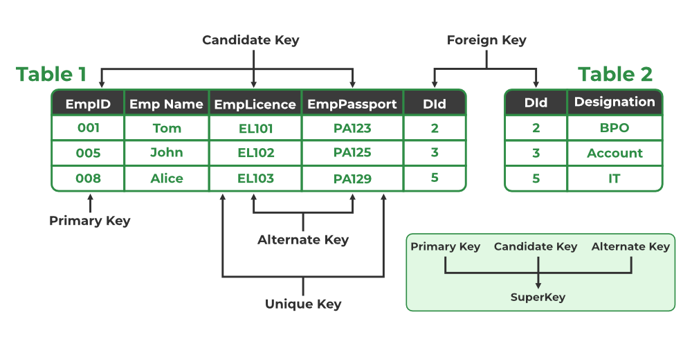
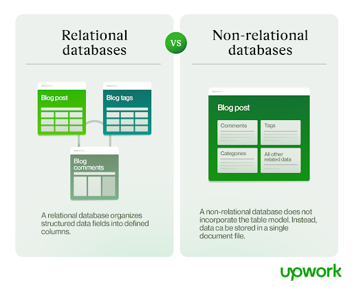

# Database Management Systems
Software systems used to store, retrieve, and run queries on data.
There are two types of DBMSs: relational(SQL) and non-relational(NoSQL)

## realational database

Consisting two or more tables with columns and rows. 

**Each column** represent property of that item.

**Each row** represent item.

Realation between table and field are called a **schema**.

**Primary keys** serve as unique identifiers for each column in a database table. 

**Foreign keys** link data in one table to the data in another table

Using SQL query to communicate with server

**Schema must be clearly defiend**.

credit: [geeksforgeeks](https://www.geeksforgeeks.org/types-of-keys-in-relational-model-candidate-super-primary-alternate-and-foreign/)

## non-relational database
stores information as document

**Schema don't have to be defiend**.

## Relational databases vs non realtional databases

credit: [upwork](https://www.upwork.com/resources/nosql-vs-sql#sql-database)
